🚆 Train Passengers Chat App - UI Demo

Welcome to the Train Passengers Chat App demo repository!

This repository contains only the UI components of the Train Passengers Chat App. It serves as a showcase for the front-end design and layout of the app. All back-end logic, database connections, and any proprietary code have been excluded from this repository due to company confidentiality.

## 🚀 Overview
A **real-time communication app for train passengers**, enabling secure and seamless interactions.  
Built with **gRPC** for efficient communication and **Keycloak** for secure authentication.  

---

## ✨ Features
- 💬 **Real-Time Chat** between passengers using gRPC.  
- 🔐 **Secure Authentication & Authorization** via Keycloak.  
- 📱 **Responsive UI** with clean architecture.  
- 🔄 **Offline-first support** with local storage.  
- ⚡ **Optimized performance** with scalable API integration.  

---

## 📸 Screenshots  

| Screen 1 | Screen 2 | Screen 3 |
|:--------:|:--------:|:--------:|
| 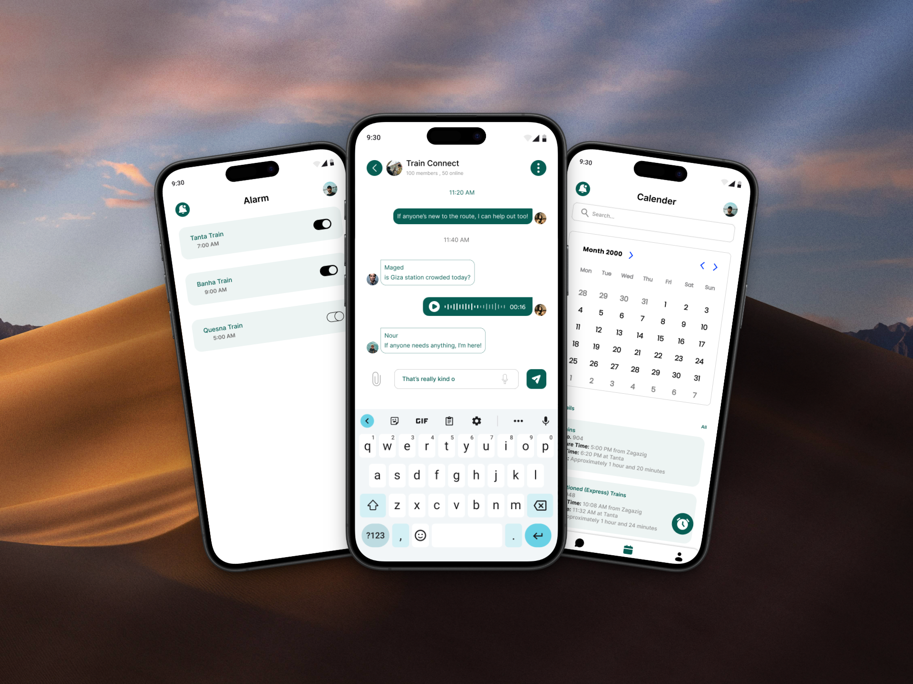 | 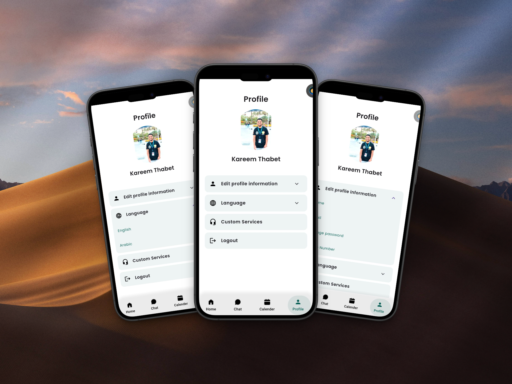 | 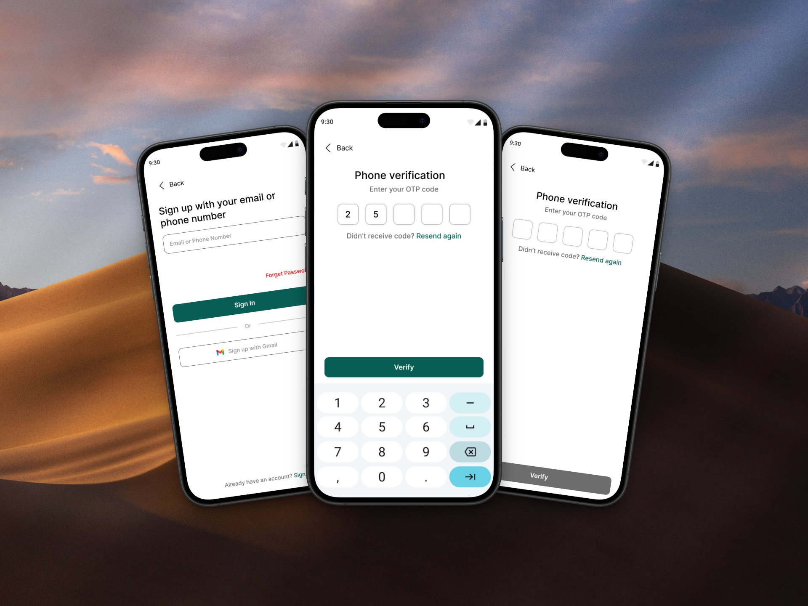 |

| Screen 4 | Screen 5 | Screen 6 |
|:--------:|:--------:|:--------:|
| 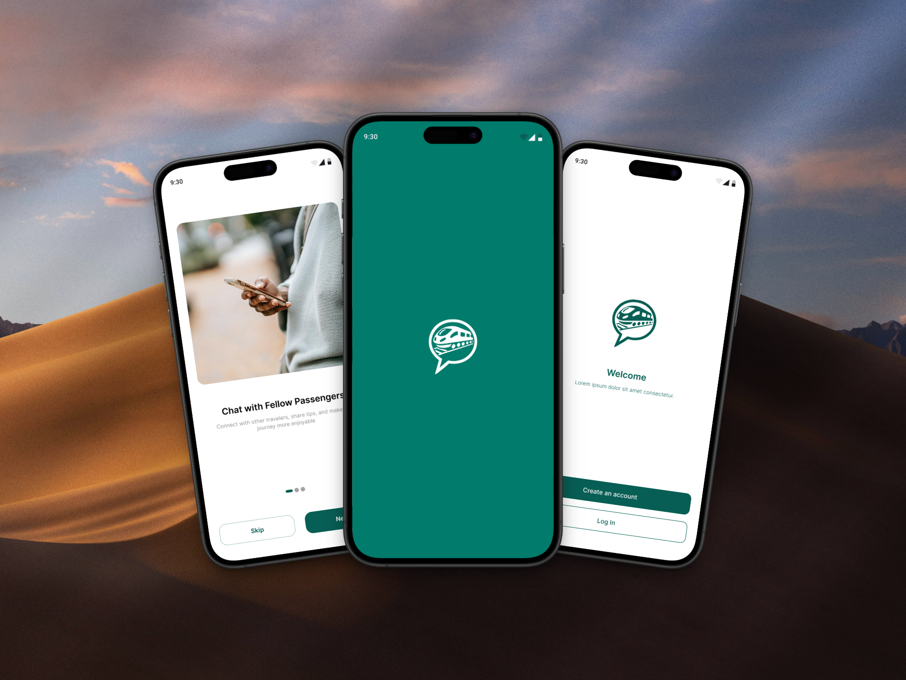 | 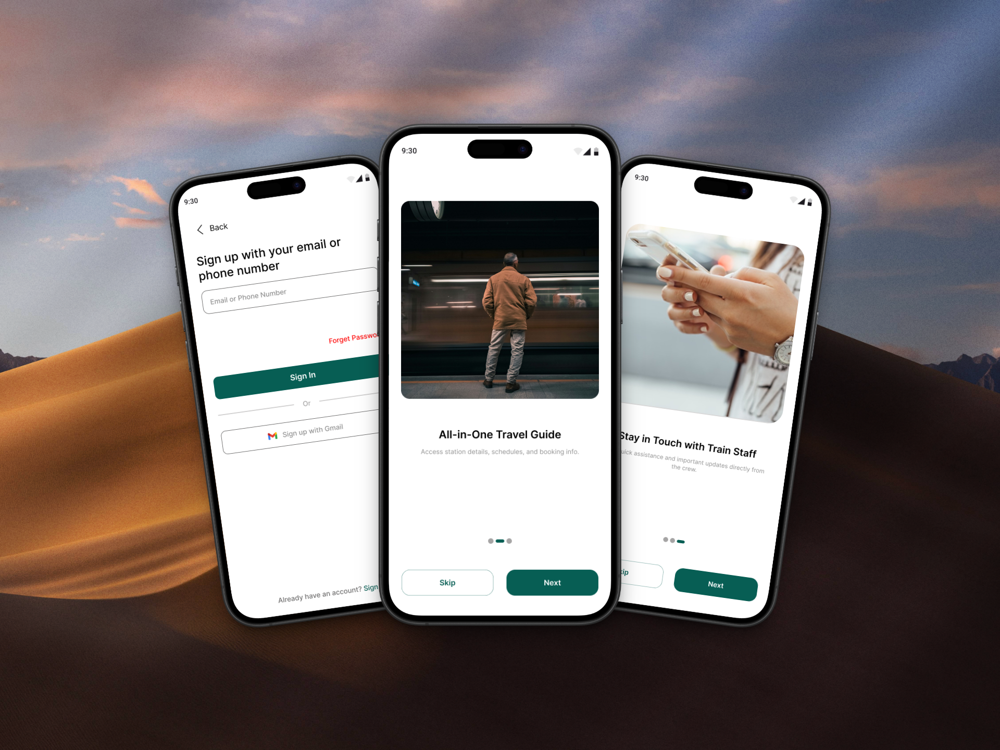 | 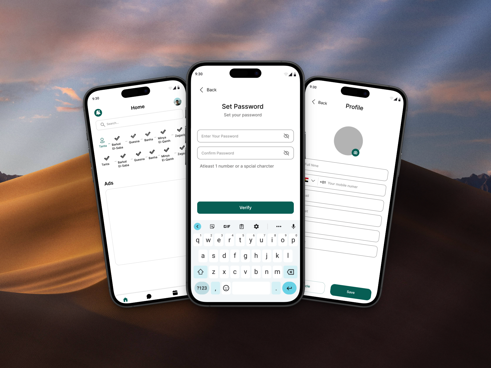 |

---

### 🔹 Onboarding & Welcome
| Onboarding 1 | Onboarding 2 | Onboarding 3 |
|:------------:|:------------:|:------------:|
| 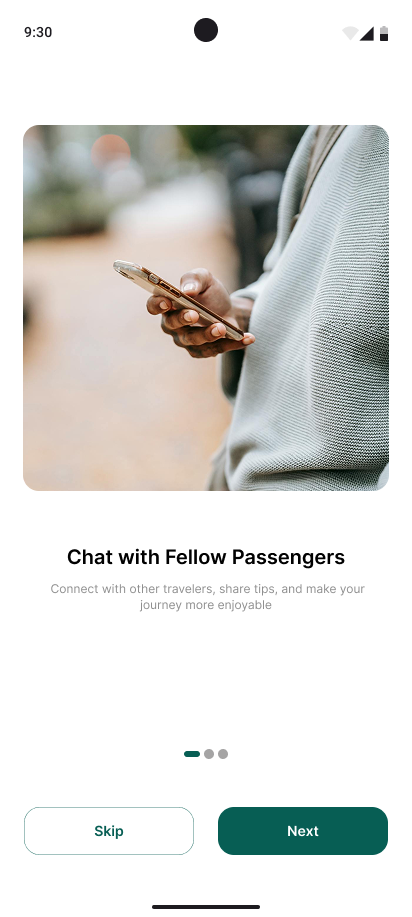 | 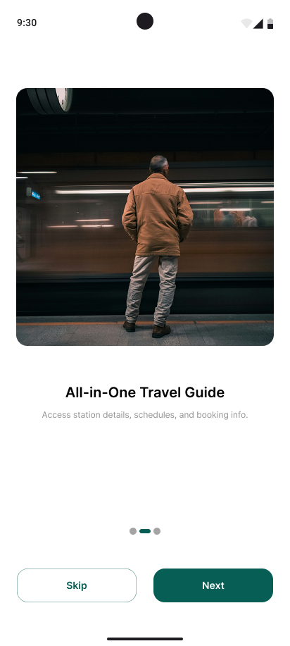 | 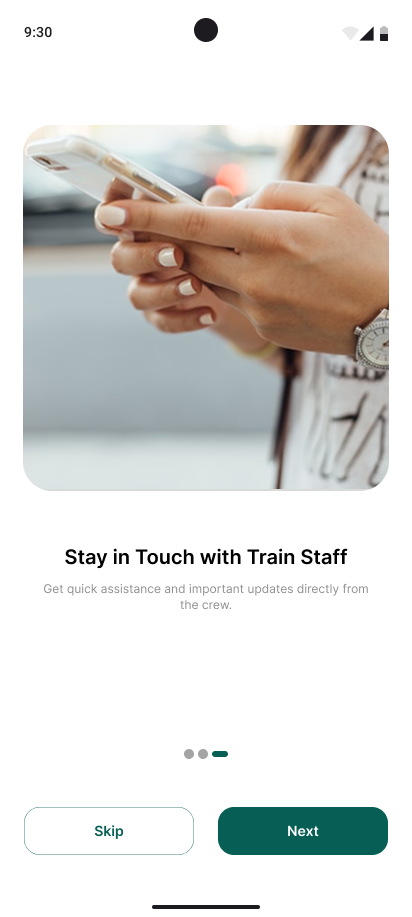 |

| Splash | Welcome | Sign Up |
|:------:|:-------:|:-------:|
|  | 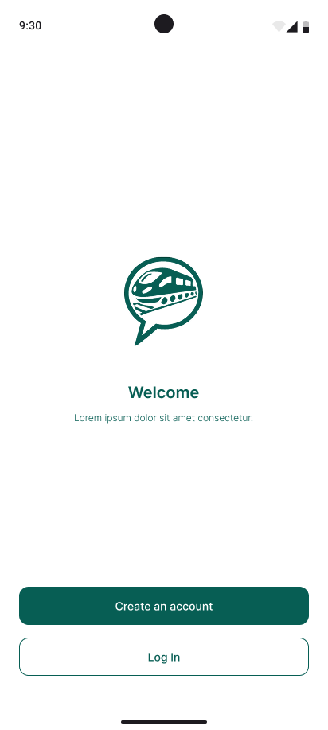 |  |

| Sign In | Verify | Verify (Alt) |
|:-------:|:------:|:------------:|
|  | 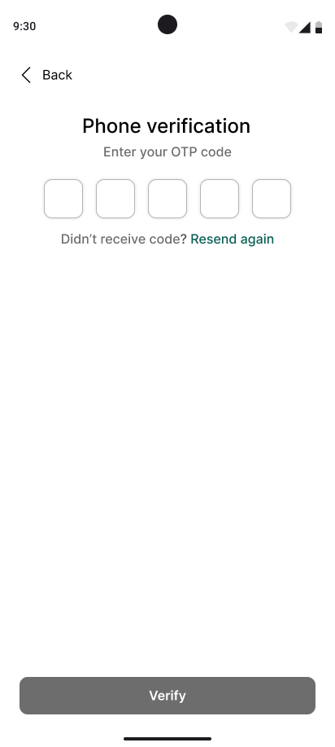 | 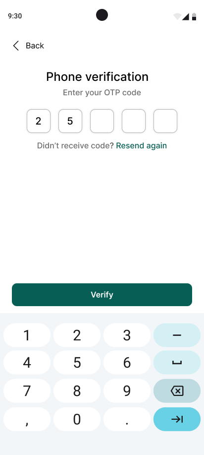 |

| Set Password |
|:------------:|
|  |

---

### 🔹 Core App Screens
| Home | Chat | Calendar |
|:----:|:----:|:--------:|
| 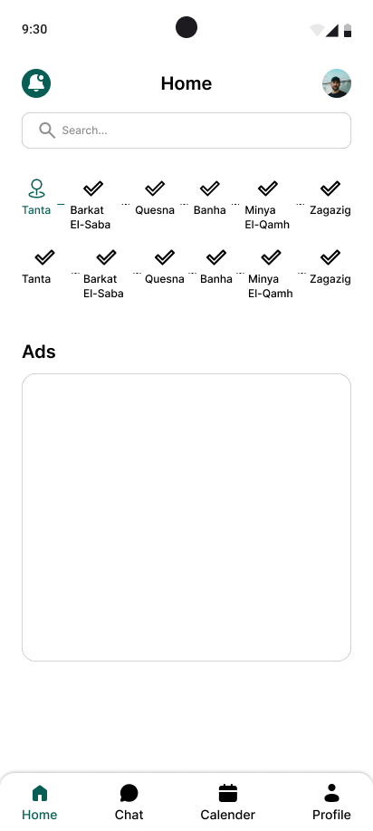 | 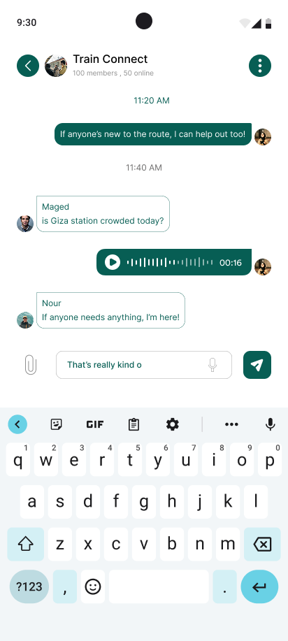 | 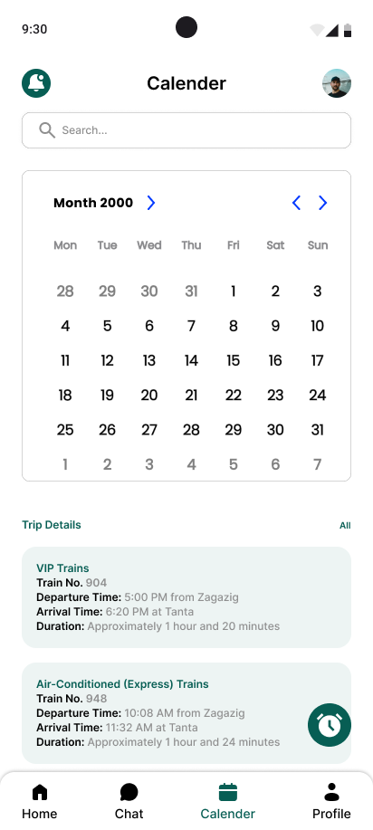 |

| Alarm | Profile | Profile (Alt 1) |
|:-----:|:-------:|:---------------:|
| 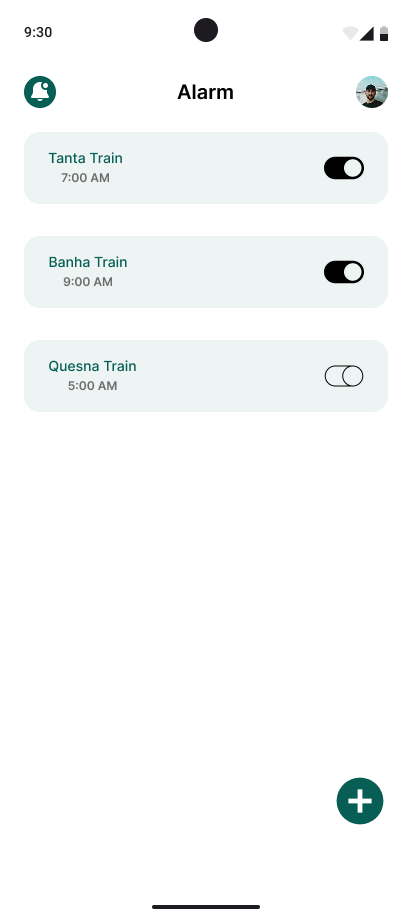 | 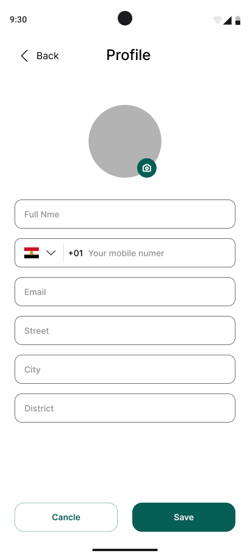 | 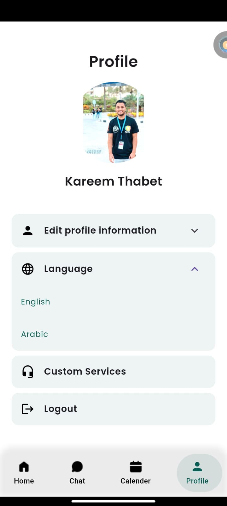 |

| Profile (Alt 2) | Profile (Alt 3) |
|:---------------:|:---------------:|
| 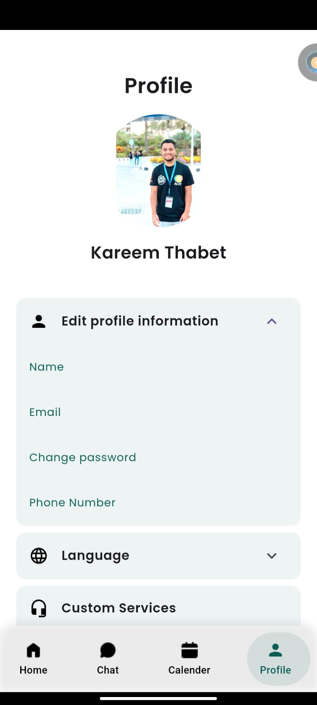 | 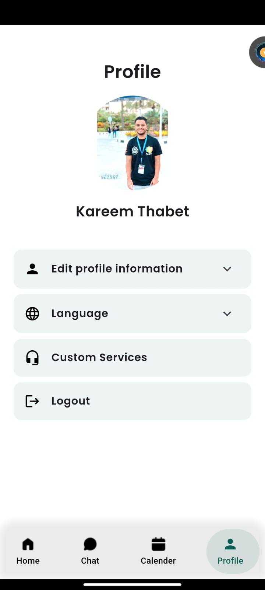 |

---

## 🛠 Tech Stack
- **Flutter** (cross-platform mobile framework)  
- **gRPC** (real-time communication)  
- **Keycloak** (secure authentication & authorization)  
- **Clean Architecture** & Offline-first storage  

---

## 📂 Status
🚧 Project is currently in development and pending release on Google Play.  

---
